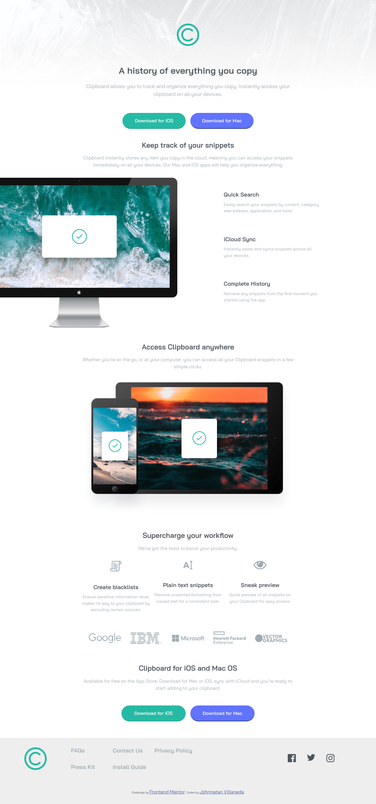
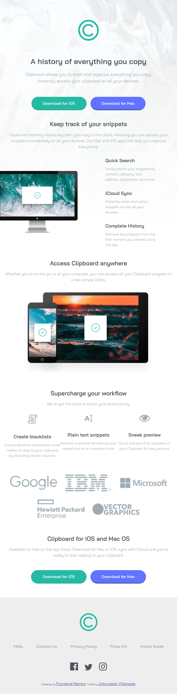

# Frontend Mentor - Clipboard landing page solution

This is a solution to the [Clipboard landing page challenge on Frontend Mentor](https://www.frontendmentor.io/challenges/clipboard-landing-page-5cc9bccd6c4c91111378ecb9). Frontend Mentor challenges help you improve your coding skills by building realistic projects.

## Table of contents

- [Overview](#overview)
  - [The challenge](#the-challenge)
  - [Screenshot](#screenshot)
  - [Links](#links)
- [My process](#my-process)
  - [Built with](#built-with)
  - [What I learned](#what-i-learned)
  - [Continued development](#continued-development)
  - [Useful resources](#useful-resources)
- [Author](#author)

## Overview

### The challenge

Users should be able to:

- View the optimal layout for the site depending on their device's screen size
- See hover states for all interactive elements on the page

### Screenshot





### Links

- Solution URL: [Github Repository](https://github.com/JohnnatanV/clipboard-landing-page)
- Live Site URL: [Github Page](https://johnnatanv.github.io/clipboard-landing-page/)

## My process

### Built with

- Semantic HTML5 markup
- CSS custom properties
- Flexbox
- CSS Grid
- Mobile-first workflow

### What I learned

I learned a new method to change use the svg imges and change their color on query events in this case on hover.

change the svg color exactly in the color i need using filters

To see how you can add code snippets, see below:

```css
.facebook:hover {
  /* #1976d2 */
  filter: invert(44%) sepia(56%) saturate(1105%) hue-rotate(178deg) brightness(
      81%
    ) contrast(105%);
}
```

### Continued development

This is the first landing page i do, Can see that the aproach is different than others and need to work more in my use of the space in the page, was a great challenge for me

### Useful resources

- [W3schools](https://www.w3schools.com/howto/howto_css_image_grid_responsive) - This is the example that I sue for the layaout of the logo images it was perfect to undertand the use of flex in a precise case.
- [Codepen - filter generator](https://codepen.io/sosuke/pen/Pjoqqp) - Here i find the filter generator for the hover buttons that use svg image file.

## Author

- Website - [Johnnatan Villaneda](https://github.com/JohnnatanV)
- Frontend Mentor - [@JohnnatanV](https://www.frontendmentor.io/profile/JohnnatanV)
- Twitter - [@JohnnatanV](https://twitter.com/JohnnatanV)
